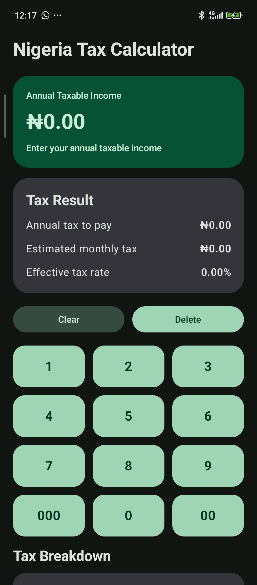
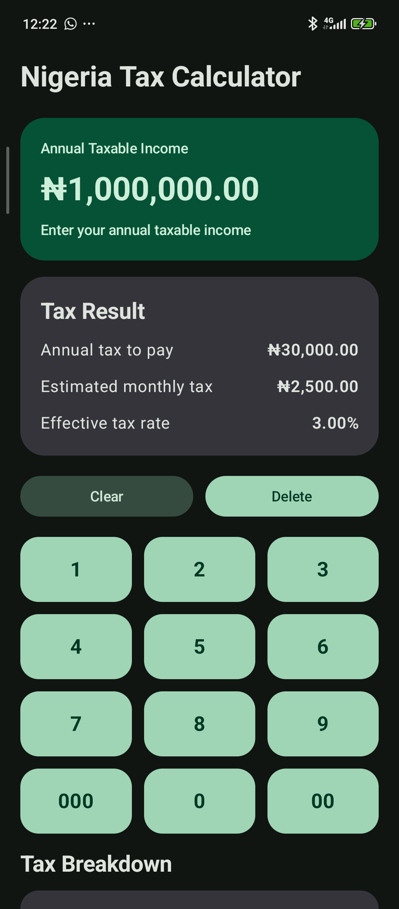

# Tax Calculator

An Android application that calculates personal income tax based on the user's annual income using the **2026 Nigerian progressive tax rates**. 
The app provides a simple, intuitive interface built with **Jetpack Compose** for a smooth user experience.

## Features

- Calculate personal income tax based on annual income.
- Implements **Nigerian 2026 Tax Act** progressive rates.
- Clean and intuitive user interface.
- Quick and accurate tax computation.

## Tax Brackets (2026 Nigeria)

The tax is calculated progressively according to the following rates:

- **0%** for the first ₦800,000
- **15%** for income from ₦800,001 to ₦3,000,000
- **18%** for income from ₦3,000,001 to ₦12,000,000
- **21%** for income from ₦12,000,001 to ₦25,000,000
- **23%** for income from ₦25,000,001 to ₦50,000,000
- **25%** for income above ₦50,000,000

> Example: If your annual income is ₦5,000,000, 
> your tax will be calculated progressively across each bracket, not just a single rate.

## Screenshots

