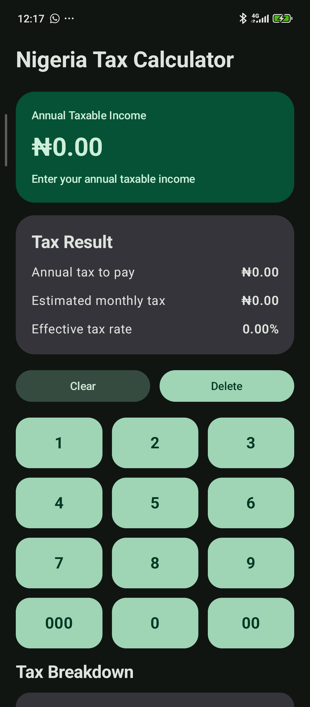
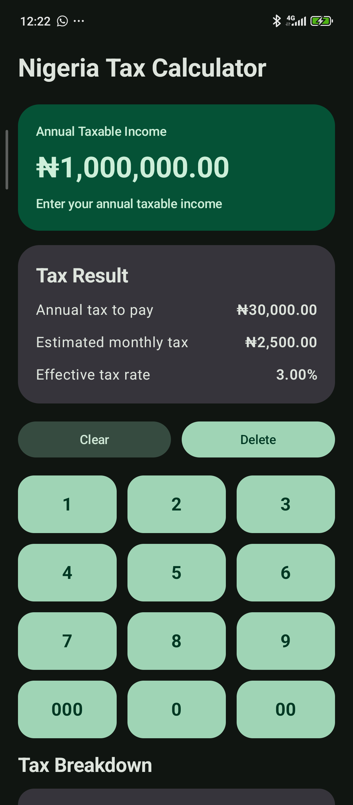
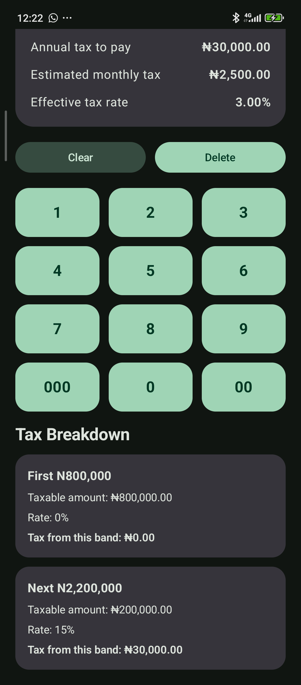

# Nigeria Tax Calculator

This is a simple Android app built with Kotlin and Jetpack Compose. It works like a beginner-friendly calculator and helps users estimate how much personal income tax they should pay with the 2026 Nigerian tax bands.

## What the app does

- Lets the user enter annual taxable income with calculator-style buttons.
- Calculates total annual tax.
- Shows estimated monthly tax.
- Shows the effective tax rate.
- Displays a simple breakdown of how much tax comes from each tax band.

## 2026 Nigerian tax bands used in the app

- First `N800,000` at `0%`
- Next `N2,200,000` at `15%`
- Next `N9,000,000` at `18%`
- Next `N13,000,000` at `21%`
- Next `N25,000,000` at `23%`
- Any amount above `N50,000,000` at `25%`

## Project style

The code is intentionally kept simple and readable so it still feels like a small student or beginner-level Android project.

## Screenshots

    
    
    
    

